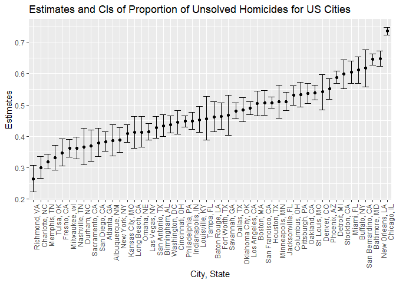

p8105_hw5_yl5215
================
Yucheng Li
2022-11-16

``` r
library(tidyverse)
```

    ## Warning: package 'tidyverse' was built under R version 4.1.3

    ## -- Attaching packages --------------------------------------- tidyverse 1.3.2 --
    ## v ggplot2 3.3.5      v purrr   0.3.4 
    ## v tibble  3.1.6      v dplyr   1.0.10
    ## v tidyr   1.1.4      v stringr 1.4.0 
    ## v readr   2.1.1      v forcats 0.5.1

    ## Warning: package 'dplyr' was built under R version 4.1.3

    ## -- Conflicts ------------------------------------------ tidyverse_conflicts() --
    ## x dplyr::filter() masks stats::filter()
    ## x dplyr::lag()    masks stats::lag()

# Problem 2

``` r
homicide = 
  read_csv("data/homicide.csv") %>%
  janitor::clean_names()
```

    ## Rows: 52179 Columns: 12
    ## -- Column specification --------------------------------------------------------
    ## Delimiter: ","
    ## chr (9): uid, victim_last, victim_first, victim_race, victim_age, victim_sex...
    ## dbl (3): reported_date, lat, lon
    ## 
    ## i Use `spec()` to retrieve the full column specification for this data.
    ## i Specify the column types or set `show_col_types = FALSE` to quiet this message.

## Decribe the raw data

The dataset contains 12 variables and 52179 observations. The variables
included are uid, reported_date, victim_last, victim_first, victim_race,
victim_age, victim_sex, city, state, lat, lon, disposition. `uid`
represents case ID which is composed of city name and a number.
`victim_last`, `victim_first`, `victim_race`, `victim_age`, `victim_sex`
represent the last name, first name, race, age, and sex of the victim,
respectively. `city` and `state` represent the city and state where the
incident happened, and `lat` and `lon` represent the latitude longitude
where the incident happened. `disposition` indicates that the case is
either “Closed by arrest”, “Closed without arrest”, or “Open/No arrest”.

## number of homicides and number of unsolved homicides in each city

``` r
homicide = 
  homicide %>% 
  mutate(city_state = paste(city, state, sep = ", ", collapse = NULL))
total_homicide = 
  homicide %>% 
  group_by(city_state) %>% 
  summarize(number_of_homicides = n())
unsolved_homicide = 
  homicide %>%
  filter(disposition != "Closed by arrest") %>% 
  group_by(city_state) %>% 
  summarize(number_of_unsolved_homicides = n())
total_unsolved_homicide = 
  left_join(total_homicide, unsolved_homicide) %>% 
  replace(is.na(.), 0)
total_unsolved_homicide
```

    ## # A tibble: 51 x 3
    ##    city_state      number_of_homicides number_of_unsolved_homicides
    ##    <chr>                         <int>                        <int>
    ##  1 Albuquerque, NM                 378                          146
    ##  2 Atlanta, GA                     973                          373
    ##  3 Baltimore, MD                  2827                         1825
    ##  4 Baton Rouge, LA                 424                          196
    ##  5 Birmingham, AL                  800                          347
    ##  6 Boston, MA                      614                          310
    ##  7 Buffalo, NY                     521                          319
    ##  8 Charlotte, NC                   687                          206
    ##  9 Chicago, IL                    5535                         4073
    ## 10 Cincinnati, OH                  694                          309
    ## # ... with 41 more rows

## Proportion of unsolved homicides in Baltimore, MD

``` r
bal_unsolved_prop = 
  prop.test(1825, 2827, p = NULL, 
            alternative = "two.sided", conf.level = 0.95, correct = TRUE)
bal_unsolved_prop
```

    ## 
    ##  1-sample proportions test with continuity correction
    ## 
    ## data:  1825 out of 2827, null probability 0.5
    ## X-squared = 239.01, df = 1, p-value < 2.2e-16
    ## alternative hypothesis: true p is not equal to 0.5
    ## 95 percent confidence interval:
    ##  0.6275625 0.6631599
    ## sample estimates:
    ##         p 
    ## 0.6455607

``` r
bal_unsolved_prop_tibble = broom::tidy(bal_unsolved_prop)
bal_unsolved_prop_tibble
```

    ## # A tibble: 1 x 8
    ##   estimate statistic  p.value parameter conf.low conf.high method    alternative
    ##      <dbl>     <dbl>    <dbl>     <int>    <dbl>     <dbl> <chr>     <chr>      
    ## 1    0.646      239. 6.46e-54         1    0.628     0.663 1-sample~ two.sided

``` r
bal_unsolved_prop_tibble %>% pull(estimate)
```

    ##         p 
    ## 0.6455607

``` r
bal_unsolved_prop_tibble %>% pull(conf.low)
```

    ## [1] 0.6275625

``` r
bal_unsolved_prop_tibble %>% pull(conf.high)
```

    ## [1] 0.6631599

``` r
bal_unsolved_prop_tibble %>% mutate(ci = paste("(", round(conf.low, 4), ",", round(conf.high, 4), ")")) %>% pull(ci)
```

    ## [1] "( 0.6276 , 0.6632 )"

``` r
bal_unsolved_prop_tibble
```

    ## # A tibble: 1 x 8
    ##   estimate statistic  p.value parameter conf.low conf.high method    alternative
    ##      <dbl>     <dbl>    <dbl>     <int>    <dbl>     <dbl> <chr>     <chr>      
    ## 1    0.646      239. 6.46e-54         1    0.628     0.663 1-sample~ two.sided

## Estimate of the proportion of unsolved homicides and its confidence interval for each city

``` r
unsolved_prop = 
  total_unsolved_homicide %>% 
  filter(city_state != "Tulsa, AL") %>% 
  mutate(result = purrr::map2(.x = number_of_unsolved_homicides, .y = number_of_homicides, ~broom::tidy(prop.test(x = .x, n = .y, alternative = "two.sided", conf.level = 0.95, correct = TRUE)))) %>% 
  unnest(result) %>% 
  select(city_state, estimate, conf.low, conf.high) %>% 
  mutate(confidence_interval = paste("(", round(conf.low, 4), ",", round(conf.high, 4), ")"))

unsolved_prop
```

    ## # A tibble: 50 x 5
    ##    city_state      estimate conf.low conf.high confidence_interval
    ##    <chr>              <dbl>    <dbl>     <dbl> <chr>              
    ##  1 Albuquerque, NM    0.386    0.337     0.438 ( 0.3373 , 0.4376 )
    ##  2 Atlanta, GA        0.383    0.353     0.415 ( 0.3528 , 0.4148 )
    ##  3 Baltimore, MD      0.646    0.628     0.663 ( 0.6276 , 0.6632 )
    ##  4 Baton Rouge, LA    0.462    0.414     0.511 ( 0.4142 , 0.511 ) 
    ##  5 Birmingham, AL     0.434    0.399     0.469 ( 0.3992 , 0.469 ) 
    ##  6 Boston, MA         0.505    0.465     0.545 ( 0.4646 , 0.5451 )
    ##  7 Buffalo, NY        0.612    0.569     0.654 ( 0.5688 , 0.6541 )
    ##  8 Charlotte, NC      0.300    0.266     0.336 ( 0.2661 , 0.3359 )
    ##  9 Chicago, IL        0.736    0.724     0.747 ( 0.724 , 0.7474 ) 
    ## 10 Cincinnati, OH     0.445    0.408     0.483 ( 0.408 , 0.4831 ) 
    ## # ... with 40 more rows

Data for Tulsa, AL was dropped because it only contains 1 observation
and cannot be used to obtain any meaningful inference.

## Plot showing estimates and confidence intervals

``` r
unsolved_plot = 
  unsolved_prop %>% 
  ggplot(aes(x = reorder(city_state, estimate), y = estimate)) + 
  geom_point() +
  geom_errorbar(aes(ymin = conf.low, ymax = conf.high)) +
  theme(axis.text.x = element_text(angle = 90, hjust = 1)) +
  labs(title = "Estimates and CIs of Proportion of Unsolved Homicides for US Cities", x = "City, State", y = "Estimates")
unsolved_plot
```

<!-- -->
